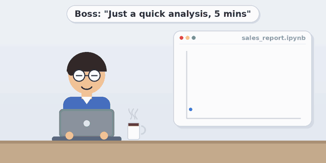

<!-- ===================== HERO ===================== -->

 

# 👋 Hi, I'm Dharm Prakash
### We Turn Data into Decision

### Statistics Student 

  
  
  

---

## 🧑‍💻 About Me

I am **Dharm Prakash**, an **M.Sc. Statistics student at Banaras Hindu University (BHU)** with a strong interest in **Data Science, Machine Learning, Statistical Modeling, and Deep Learning**.

I enjoy combining **statistical thinking with machine learning** to solve real-world problems and extract meaningful insights from data.

### 🔎 Areas of Interest

- 📊 Statistical Modeling & Data Analysis
- 🤖 Machine Learning & Deep Learning
- 🧠 Generative AI
- 🏥 Healthcare Analytics
- 📈 Statistical Inference & Regression

---

## 🛠️ Tech Stack

---

## 🔬 Research & Projects

### 🧩 Missing Data Imputation, Fairness & Explainability

Research project at **IIT BHU** exploring the impact of missing-data imputation on machine learning fairness and explainability.

**Focus Areas:**

`MCAR` • `MAR` • `MNAR` • `Imputation` • `Fairness` • `SHAP` • `Diffusion Models`

---

### 🏥 Multi-Class Bladder Cancer Classification

Machine learning approach for classifying bladder cancer and related diseases using clinical laboratory data.

**Techniques:**

`Feature Engineering` • `Mutual Information` • `SMOTE` • `Cross-Validation` • `AUC`

---

### 🧬 MSI Prediction from Histopathology Images

Deep learning pipeline for predicting **MSI vs MSS status** from colorectal cancer histopathology images.

**Models:**

`CNN` • `ResNet-50` • `Transfer Learning` • `Data Augmentation` • `FP16`

---

### 💳 Credit Card Default Risk & Customer Segmentation

Built a machine learning based credit-risk prediction and customer segmentation system.

**Techniques:**

`Logistic Regression` • `Random Forest` • `XGBoost` • `K-Means` • `SMOTE`

---

## 📊 GitHub Statistics

<table>
<tr>

<td width="50%" align="center">

### 💻 GitHub Stats

<picture>
  <source
    media="(prefers-color-scheme: dark)"
    srcset="https://github-readme-stats.shion.dev/api?username=Dharm-prakash&show_icons=true&hide_border=true&bg_color=00000000&title_color=58A6FF&text_color=C9D1D9&icon_color=58A6FF&border_radius=16"
  />

  <source
    media="(prefers-color-scheme: light)"
    srcset="https://github-readme-stats.shion.dev/api?username=Dharm-prakash&show_icons=true&hide_border=true&bg_color=00000000&title_color=0969DA&text_color=24292F&icon_color=0969DA&border_radius=16"
  />

  
</picture>

</td>

<td width="50%" align="center">

### 🔥 Contribution Streak

<picture>
  <source
    media="(prefers-color-scheme: dark)"
    srcset="https://streak-stats.demolab.com/?user=Dharm-prakash&hide_border=true&background=00000000&stroke=30363D&ring=58A6FF&fire=FF7B72&currStreakNum=C9D1D9&sideNums=C9D1D9&currStreakLabel=8B949E&sideLabels=8B949E&dates=8B949E&border_radius=16"
  />

  <source
    media="(prefers-color-scheme: light)"
    srcset="https://streak-stats.demolab.com/?user=Dharm-prakash&hide_border=true&background=00000000&stroke=D0D7DE&ring=0969DA&fire=CF222E&currStreakNum=24292F&sideNums=24292F&currStreakLabel=57606A&sideLabels=57606A&dates=57606A&border_radius=16"
  />

  
</picture>

</td>

</tr>
</table>

 

### 💡 *Turning Data into Insights, Models into Solutions.*

 

